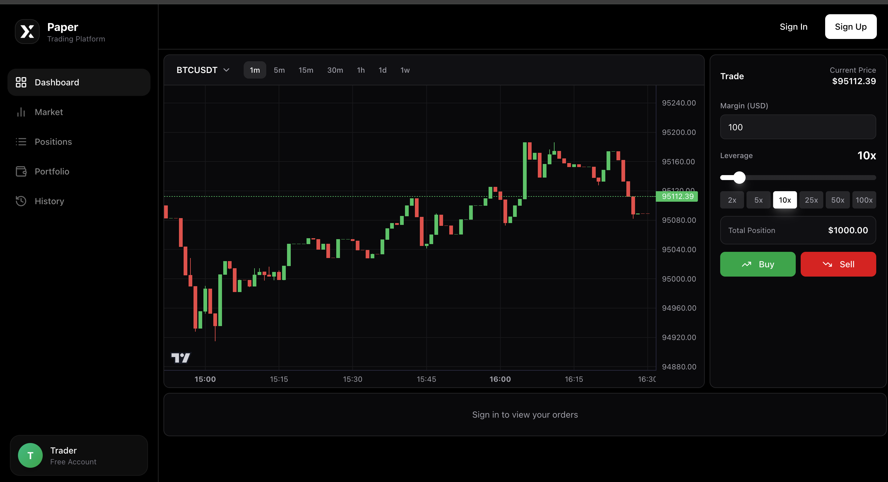
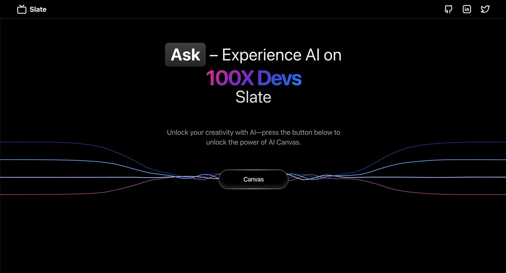
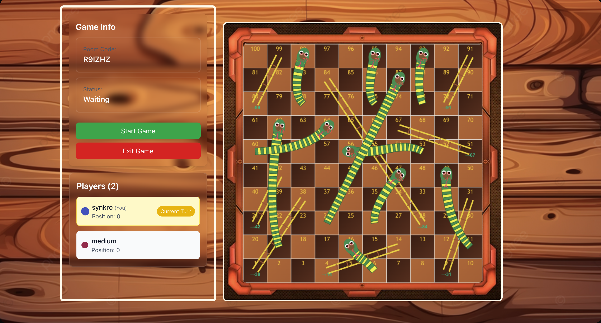
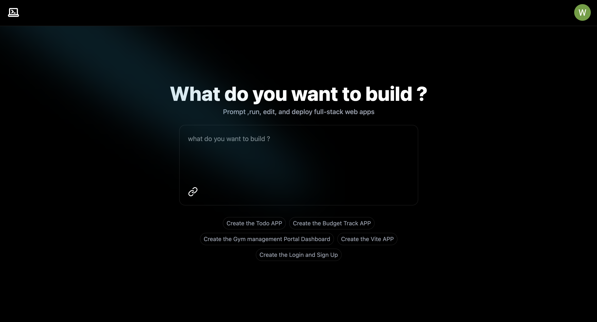
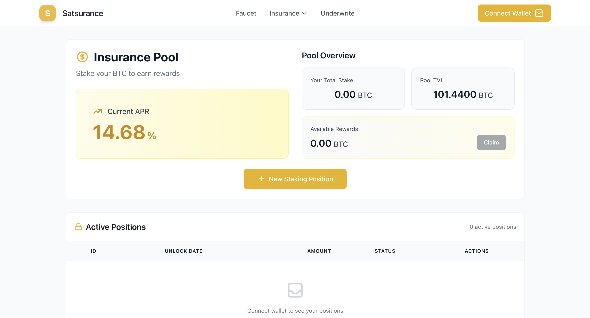
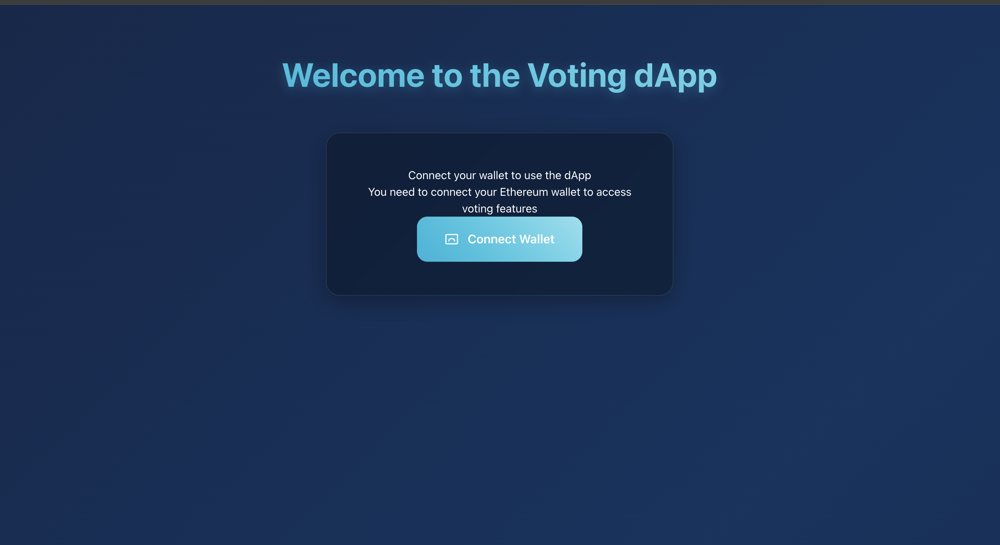

# Saijeet Nikam

---

## Proof of Work

<table bgcolor="#000000">
<tr>
<td width="33%" bgcolor="#000000">

### [Paper X Trading](https://github.com/jeetnik/exness)

**Real-time crypto trading simulator**

`Next.js` `React` `Express` `PostgreSQL` `WebSocket` `Docker` `Redis` `AWS`

</td>
<td width="33%" bgcolor="#000000">

### [Slate AI](https://github.com/jeetnik/Slate)

**AI-powered drawing platform**

`Turborepo` `TypeScript` `React` `AI` `Next.js`

</td>
<td width="33%" bgcolor="#000000">

### [Snake & Ladder](https://github.com/jeetnik/sl-frontend)

**Multiplayer board game**

`React` `WebSocket` `Node.js` `Multiplayer` `Gaming`

</td>
</tr>

<tr>
<td width="33%" bgcolor="#000000">

### [Devs AI](https://github.com/jeetnik/Devs-AI)

**AI development assistant**

`Next.js` `AI/ML` `TypeScript` `Vercel`

</td>
<td width="33%" bgcolor="#000000">

### [Satsurance](https://github.com/Satsurance/canisters)

**Bitcoin insurance protocol**

`Rust` `ICP` `ckBTC` `DeFi` `Smart Contracts`

</td>
<td width="33%" bgcolor="#000000">

### [Voting DApp](https://github.com/jeetnik/voting-dapp)

**Blockchain voting system**

`Solidity` `React` `Ethereum` `Web3`

</td>
</tr>
</table>

---
